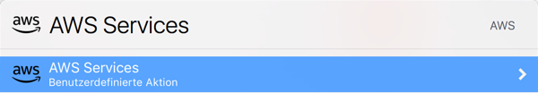
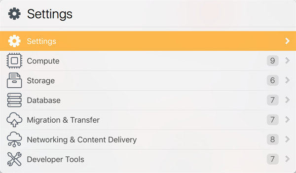

# AWS Services - LaunchBar Action

A simple action to browse through AWS service groups and services and directly jump to the service home page in the AWS console. This (obviously) works only if you haved logged in before and the session has not yet expired.

### Installation

- [Download the latest release](https://github.com/thorstenhuhn/launchbar-AwsServices/releases)
- Open the downloaded file in Finder

### Usage

Use your favorite LaunchBar shortcut to bring LaunchBar to front and enter `aws`.

From here you find a _Settings_ item at the top to perform some basic settings:

Set region from clipboard - allows you to run the AWS console in the preferred region. Just copy the string of your favorite region, e.g. `eu-central-1` to the clipboard and configure the action by selecting this list item. This works only if the clipboard content does match the correct format.

Set alternative browser from clipboard - allows you to configure a second browser beside your default browser to open a AWS services home page. This is useful when working with two accounts at the same time. To use Safari as alternative browser, copy the Safari bundle id `com.apple.safari` to the clipboard and select this item. You can let LaunchBar open a services home page using Safari by pressing the `alt`/`option` key while selecting the service item.

The action provides a list of service groups corresponding to the ones provided by AWS on the AWS console home page. You can either navigate through the groups or enter an abbreviation of the service you already know the name, e.g. `cf` will likely immediately offer the CloudFormation home page.

*Hint*: due to frequent changes at the AWS console site, the list of services is currently downloaded from a gist. Feel free to try the "Update Services List" _Settings_ item to check for updates or contact me in case of missing services.

